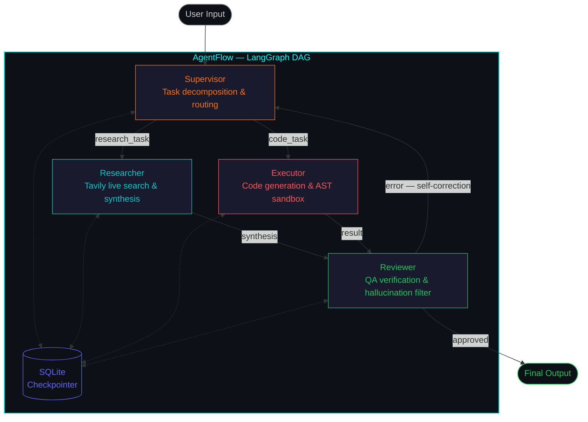
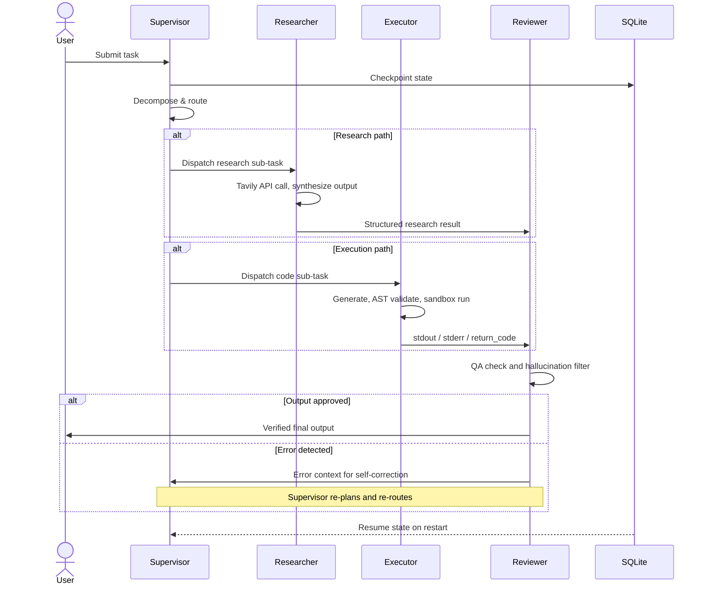

<div align="center">


<br/>

[](https://www.python.org/)
[](https://langchain-ai.github.io/langgraph/)
[](https://groq.com/)
[](https://aagentflow-siddhantchandorkar752.streamlit.app/)
[](LICENSE)


<br/>

> **AgentFlow** is a production-grade, self-correcting multi-agent orchestration framework that executes complex tasks through a stateful Directed Acyclic Graph (DAG) pipeline — with deterministic output verification and zero hallucinations.

<br/>

[Quick Start](#-getting-started) · [Architecture](#-architecture) · [Agent Pipeline](#-the-4-agent-pipeline) · [Use Cases](#-use-cases) · [Contributing](#-contributing) · [License](#-license)

---

</div>

## Overview

Most AI systems operate as single-pass responders — they generate an answer and stop. **AgentFlow** is architected differently.

It decomposes every incoming task across a graph of four specialized agents, each with a distinct role and a well-defined interface. Agents communicate via a strongly-typed shared state, persist that state across sessions via SQLite checkpointing, and — critically — feed failure signals back upstream to trigger autonomous re-planning. The result is a system that approaches complex tasks the way a skilled engineering team would: plan, delegate, execute, verify, and iterate.

| Capability | Traditional Chatbot | AgentFlow |
|---|---|---|
| Memory | Stateless | Stateful SQLite checkpointing |
| Hallucination control | None | Dedicated Reviewer with LLM-as-a-Judge |
| Code execution | None | AST-validated subprocess sandbox |
| Research | Static training data | Tavily-powered live web search |
| Error recovery | None | Autonomous self-correction loop |
| State typing | None | `TypedDict` + `Annotated` reducers |

---

## Architecture

AgentFlow's orchestration layer is built on **LangGraph** — a state machine framework that models agent workflows as explicit DAGs. Each agent is a node. Each data handoff is a typed edge. Conditional edges handle routing decisions at runtime.

All agent state is stored in a `TypedDict`-based `AgentState` struct and persisted via `SqliteSaver`. This means the full execution history survives process restarts, enabling reliable long-horizon tasks.

### DAG Overview



### Sequence Diagram



---

## The 4-Agent Pipeline

### Supervisor — Orchestrator

The entry point for every task. Parses intent, sets `RESEARCH_NEEDED` or `CODE_NEEDED` routing flags via a `ConditionalEdge`, and manages re-planning when the Reviewer surfaces errors.

**Stack:** `GroqLLM (LLaMA 3.3-70B)` · `LangGraph ConditionalEdge`

### Researcher — Information Retrieval

Fetches live, structured data from the open web via the **Tavily Search API** — an LLM-optimized search backend that returns clean, relevance-ranked results without HTML parsing overhead. Synthesizes multi-source information into a cited Markdown summary.

**Stack:** `TavilySearchResults` · LLM synthesis chain

### Executor — Sandboxed Runtime

Generates Python code, validates it with `ast.parse()` before execution, and runs it inside an isolated subprocess — entirely separate from the main application process. Captures `stdout`, `stderr`, and `return_code` for downstream verification.

**Stack:** `ast` module · `subprocess` · `GroqLLM`

### Reviewer — Verification Layer

Applies LLM-as-a-Judge evaluation to every output before it reaches the user. A separate LLM call assesses factual accuracy, completeness, and internal consistency. On failure, routes back to the Supervisor with structured error context, triggering a new planning cycle.

**Stack:** `GroqLLM` · custom evaluation prompt

---

## Project Structure

```text
AgentFlow/
├── agents/
│   ├── supervisor.py       # Task decomposition, conditional routing, re-planning logic
│   ├── researcher.py       # Tavily search integration and LLM synthesis chain
│   ├── executor.py         # Code generation, AST validation, subprocess sandbox
│   └── reviewer.py         # Output verification, hallucination filter, loop control
│
├── core/
│   ├── state.py            # TypedDict AgentState — strongly-typed shared state schema
│   ├── graph.py            # LangGraph DAG construction, node registration, edge logic
│   └── checkpointer.py     # SqliteSaver persistence layer for crash-safe continuity
│
├── tools/
│   ├── search_tool.py      # Tavily API wrapper and result formatter
│   └── sandbox_tool.py     # AST-validated Python execution environment
│
├── assets/
│   ├── logo.png
│   └── demo.gif
│
├── app.py                  # Streamlit dashboard — main UI entry point
├── config.py               # Centralized API keys and model configuration
├── requirements.txt        # Pinned production dependencies
├── .env.example            # Environment variable template
├── .gitignore
└── LICENSE
```

---

## Getting Started

### Prerequisites

| Dependency | Minimum Version | Verify |
|---|---|---|
| Python | `3.10` | `python --version` |
| pip | Latest | `pip --version` |
| Git | Any | `git --version` |

### 1 — Clone and create a virtual environment

```bash
git clone https://github.com/siddhantchandorkar752-ai/AgentFlow.git
cd AgentFlow

python -m venv venv

# macOS / Linux
source venv/bin/activate

# Windows
venv\Scripts\activate
```

### 2 — Install dependencies

```bash
pip install -r requirements.txt
```

### 3 — Configure environment variables

Create a `.env` file in the project root:

```env
# Groq Cloud — LLaMA 3.3-70B inference
# Obtain at: https://console.groq.com/keys
GROQ_API_KEY=your_groq_api_key_here

# Tavily — LLM-optimized live web search
# Obtain at: https://app.tavily.com/
TAVILY_API_KEY=your_tavily_api_key_here
```

> **Security note:** `.env` is excluded via `.gitignore`. Never commit API credentials to version control.

### 4 — Launch

```bash
streamlit run app.py
```

Navigate to `http://localhost:8501`. AgentFlow is ready.

---

## Use Cases

### Automated Research Reports

```
"Compare the top 5 AI orchestration frameworks in 2026. Produce a structured
table covering architecture, licensing, GitHub stars, and production maturity."
```

Supervisor dispatches to Researcher → Tavily fetches live data across multiple sources → LLM synthesizes a structured report → Reviewer validates citations and consistency → clean Markdown output delivered.

---

### Data Analysis with Code Execution

```
"Generate a synthetic financial dataset, compute a correlation matrix,
and produce a heatmap saved as correlation_matrix.png."
```

Supervisor dispatches to Executor → code generated → AST-validated before execution → runs in an isolated subprocess → output artifacts captured → Reviewer verifies result integrity.

---

### Technical Troubleshooting

```
"A Docker container is exiting with error code 137.
Diagnose the root cause and provide a verified, step-by-step remediation."
```

Supervisor routes to both Researcher (cause analysis) and Executor (fix generation) → outputs converge on Reviewer → cross-validated solution delivered.

---

### Self-Correction

When the Reviewer flags an error, it does not surface the failure to the user. Instead, structured error context is routed upstream to the Supervisor, which re-plans and dispatches a corrected attempt. This loop continues until the output is verified or the configured `recursion_limit` is reached.

---

## Engineering Highlights

| Feature | Implementation | Benefit |
|---|---|---|
| **AST Sandboxing** | `ast.parse()` + `subprocess` isolation | Prevents execution of malformed or malicious code on the host machine |
| **Stateful Persistence** | SQLite `SqliteSaver` checkpointing | Full execution state survives process restarts; long-horizon tasks resume exactly where they left off |
| **LPU Inference** | Groq LLaMA 3.3-70B | Sub-second token generation; agent latency measured in seconds, not minutes |
| **Typed State** | `TypedDict` + `Annotated` reducers | Eliminates state collisions, race conditions, and silent data loss across concurrent agent operations |
| **Self-Correction Loop** | Reviewer → Supervisor feedback arc | Autonomous error recovery without user intervention |
| **LLM-as-a-Judge** | Independent evaluation LLM call | Unbiased hallucination detection, decoupled from the generating agent |
| **Conditional Routing** | LangGraph `ConditionalEdge` | Runtime task routing — a single system handles research, execution, or both |

---

## Dependencies

```txt
# Orchestration
langgraph>=0.2.0
langchain>=0.3.0
langchain-groq>=0.1.0

# LLM Inference
groq>=0.9.0

# Live Web Search
tavily-python>=0.3.0
langchain-community>=0.3.0

# Dashboard
streamlit>=1.35.0

# Utilities
python-dotenv>=1.0.0
pydantic>=2.0.0

# SQLite ships with the Python standard library — no additional installation required.
```

---

## Roadmap

- [x] Core 4-agent DAG pipeline
- [x] AST-validated sandboxed code execution
- [x] Stateful SQLite persistence with crash recovery
- [x] Tavily live web research integration
- [x] Autonomous self-correction loop
- [x] Streamlit dashboard
- [ ] `FinanceAgent` — real-time market data and portfolio analysis
- [ ] `MemoryAgent` — long-term vector memory via ChromaDB or Pinecone
- [ ] `MultiModalAgent` — vision model integration for image analysis
- [ ] Docker Compose deployment configuration
- [ ] FastAPI REST layer for headless and programmatic access
- [ ] Async parallel branch execution across DAG nodes

---

## Contributing

Contributions are welcome. Please follow the process below to keep the codebase consistent and reviewable.

### Workflow

```bash
# 1. Fork the repository on GitHub

# 2. Create a scoped feature branch
git checkout -b feat/your-feature-name

# 3. Commit using Conventional Commits
git commit -m "feat: add FinanceAgent for real-time market analysis"

# 4. Push your branch
git push origin feat/your-feature-name

# 5. Open a Pull Request on GitHub with a clear description of the change
```

### Commit Convention

| Prefix | Purpose |
|---|---|
| `feat:` | New capability |
| `fix:` | Bug fix |
| `docs:` | Documentation only |
| `refactor:` | Code restructuring, no behavior change |
| `test:` | New or updated tests |
| `chore:` | Tooling, CI, dependency updates |

### Adding a New Agent

Create a file under `agents/` following the interface contract below, then register the node and its edges in `core/graph.py`.

```python
# agents/your_agent.py

from core.state import AgentState
from langchain_groq import ChatGroq
from config import GROQ_API_KEY, MODEL_NAME

llm = ChatGroq(api_key=GROQ_API_KEY, model=MODEL_NAME)

def your_agent_node(state: AgentState) -> AgentState:
    """
    Accepts the current AgentState, performs the agent's operation,
    and returns an updated AgentState dict.
    """
    # Implementation
    return {"messages": [...]}
```

---

## FAQ

<details>
<summary><b>Can this run entirely for free?</b></summary>

Yes. Groq's free tier provides a generous daily token allowance, and Tavily's free tier covers 1,000 searches per month — sufficient for development and personal use at no cost.

</details>

<details>
<summary><b>Can I use a different LLM provider?</b></summary>

Yes. The architecture is model-agnostic. Replace `ChatGroq` with any LangChain-compatible chat model (e.g., `ChatOpenAI`, `ChatAnthropic`) in `config.py`. No changes to agent logic are required.

</details>

<details>
<summary><b>Is the sandboxed code execution safe?</b></summary>

Two independent safety layers are applied before any user-generated code executes. First, `ast.parse()` validates syntax and rejects structurally invalid input prior to execution. Second, all code runs inside a subprocess isolated from the main application process, with no access to the parent's memory or file handles beyond what is explicitly passed.

</details>

<details>
<summary><b>Can the self-correction loop run indefinitely?</b></summary>

No. LangGraph's `recursion_limit` caps the maximum number of iterations (default: 25). If the limit is reached, the system exits gracefully and returns the last known valid state rather than failing hard.

</details>

---

## License

Distributed under the **MIT License**. See [`LICENSE`](LICENSE) for the full text.

```
MIT License — Copyright (c) 2025 Siddhant Chandorkar
```

---

<div align="center">


**Built by [Siddhant Chandorkar](https://github.com/siddhantchandorkar752-ai)**

*"Building the future of agentic AI."*

<br/>

[](https://github.com/siddhantchandorkar752-ai)

<br/>

If this project is useful to you, consider leaving a star — it helps others discover it.

</div>
